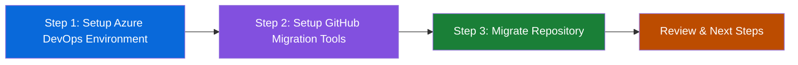

## Step 1: Setting up your Azure DevOps Environment

Welcome to the Migrate Azure DevOps Repository exercise! In this hands-on workshop, you'll learn how to migrate repositories from Azure DevOps to GitHub using GitHub's official migration tools.



To practice migrating from Azure DevOps to GitHub, you need a realistic source environment. In this exercise, you'll learn to use [GitHub Enterprise Importer](https://docs.github.com/migrations/using-github-enterprise-importer/understanding-github-enterprise-importer/about-github-enterprise-importer), GitHub's official migration tool that provides high-fidelity migrations while preserving Git history and metadata. We will ask you to use a Personal Access Token to authenticate with Azure DevOps and the provided script that will automatically build a complete project environment.

This approach simulates real-world migration scenarios where you have existing Azure DevOps projects with:

- Sample repository with code, commits, and branches
- Work items (user stories, tasks, bugs)
- Project settings and configurations

### ⌨️ Activity: Login to Codespace

Let's start up our project environment. This lab **must** be ran from within a GitHub Codespace.

1. Use the below button to open the **Create Codespace** page in a new tab. Use the default configuration.

   [](https://codespaces.new/{{full_repo_name}}?quickstart=1)

1. Wait a moment for Visual Studio Code to fully load in your browser. This can take a minute or two.

### ⌨️ Activity: Create Azure DevOps Personal Access Token

Now let's configure [Azure DevOps](https://dev.azure.com/) credentials so we can create a mock project for this lab.

> [!NOTE]
> If you do not have an Azure DevOps account you can sign up for free by following this [guide](https://learn.microsoft.com/azure/devops/user-guide/sign-up-invite-teammates?view=azure-devops&tabs=microsoft-account). Once you have an account you can create a new organization using these [instructions](https://learn.microsoft.com/azure/devops/organizations/accounts/create-organization?view=azure-devops).

1. Navigate to your [Azure DevOps](https://dev.azure.com/) organization in a new browser tab.
1. Click on `User Settings` in top right corner, next to your profile picture.
1. Select `Personal access tokens` from the dropdown menu. Click `New Token` to create a new personal access token.
1. Give your token a descriptive name (e.g., `GitHub Skills Migration Exercise`) and set the expiration to a shorter duration (e.g., 1 day).
1. Under `Scopes`, select `Custom defined` and choose the following scopes:

   - **Project and Team**: Read, write & manage (to create a project)
   - **Code**: Read, write & manage (to create repositories, branches, and files)
   - **Work Items**: Read & write (to create work items)
   - **Build**: Read & execute (to create and manage pipelines)
   - **Identity**: Read (required for migration tools)

    
    <details>
    <summary>Can't see some scopes? 👀 </summary><br/>
    
    Click **Show all scopes** at the bottom of this view
   
    

    </details>
    
1. Click `Create` and store the token securely as you won't be able to see it again.

### ⌨️ Activity: Create Mock Azure Project

Now it's time to use that token to create a mock ADO project that we will migrate to GitHub in the next steps!

1. First, configure your Azure DevOps organization URL by opening the config file `ado/config.yml` in your codespace.

1. Update the `ado_url` value with your Azure DevOps organization URL (e.g., `https://dev.azure.com/your-org`):

1. Run the bootstrap script, this will source information from the config file and run a [Terraform](https://developer.hashicorp.com/terraform) script to create a project.

   ```bash
   ./ado/bootstrap.sh --ado-token "YOUR_TOKEN_HERE"
   ```

1. Watch the script output as it initializes and applies the Terraform configuration.
1. Mona will comment here with the next step as the script completes successfully.

<details>
<summary>Having trouble? 🤷</summary><br/>

- Double-check that your organization URL is correct
- If you get permission errors, verify your token has the right scopes and run the command again

</details>
